# JavaScript Profesional

## Como llegá uin script al navegador

El **DOM** es la representación que hace el navegador de un documento HTML.

El navegador interpreta el archivo HTML y cuando termina de transformarlo al DOM se dispara el evento DOMContentLoaded lo que significa que todo el documento está disponible para ser manipulado.

Todo script que carguemos en nuestra página tiene un llamado y una ejecución.

Tanto con async como defer podemos hacer llamados asíncronos pero tiene sus diferencias:

- async. Con async podemos hacer la petición de forma asíncrona y no vamos a detener la carga del DOM hasta que se haga la ejecución del código.
- defer. La petición es igual asíncrona como en el async pero va a deferir la ejecución del Javascript hasta el final de que se cargue todo el documento.
- scripts embebidos: el navgador carga linea a linea el html y cuando se encuentra un codigo entre scripts va a deter su ejecución hasta que hallá procesado todo el script.

Hay que tener en cuenta que cuando carga una página y se encuentra un script a ejecutar toda la carga se detiene. Por eso se recomienda agregar tus scripts justo antes de cerrar el body para que todo el documento esté disponible.

## Scope

El Scope o ámbito es lo que define el tiempo de vida de una variable, en que partes de nuestro código pueden ser usadas.

**Global Scope**
Variables disponibles de forma global se usa la palabra var, son accesibles por todos los scripts que se cargan en la página. Aquí hay mucho riesgo de sobreescritura.

**Function Scope**
Variables declaradas dentro de una función sólo visibles dentro de ella misma (incluyendo los argumentos que se pasan a la función).

**Block Scope**
Variables definidas dentro de un bloque, por ejemplo variables declaradas dentro un loop while o for. Se usa let y const para declarar este tipo de variables.

**Module Scope**
Cuando se denota un script de tipo module con el atributo type="module las variables son limitadas al archivo en el que están declaradas.

Esto va a declarar que esté archivo es un modulo, estó no estan en todos los navegadores pero si en los más modernos. Los valores que teníamos escritos ahora no los vamos a poder leer en consola porque el module scope está limitando el alcance 

## Clouseres

El scope cuando lo juntamos con funciones podemos lograr algo que se llamán clouseres o clausuras, para entender bien vemos un ejemplo:

```js
// Clouseres
// printColor
let color = 'green';
function printColor() {
  console.log(color);
}
```

Podemos observar que la variable global está en el scope global, para evitar eso lo que vamos a hacer es crear una función que se va a llamár autómaticamente

```js
// IFEE: immediately invoked function expression
(function () {
  let color = 'green';

  function printColor() {
    console.log(color);
  }

  printColor();
})();

```
Sacamos esté codigó del entorno global, lo pasamos a uno de una función y entonces color no cruza al scope global. Cuando tenemos está declaración y está ejecución que se declara afuera de l función interna, **estó es un Closures**. Es la combinación del scope de una función y el scope donde fue definida, donde el scope de la función es la función *IFEE* la función principal, y adentro la función que fue definida dentro de ese scopeque tiene acceso a lo que estaba afuera.

Clouseres nos va a permitir tener una funcionalidad o feture que el lenguaje no trae: variables privadas

```js
// Clousers Jasan Hernández.
// ¿Variables privadas?
const counter1 = {
  count: 3
}
// count esta en el scope Global Window
console.log(counter1.count);
// Podemos modificar su valor si quisieramos
counter1.count = 99;
console.log(counter1.count);

// Clouseres - creamos un function scope
function makeCounter(n) {
  // count ya no existe en window, ahora
  // solo pertenece a la función
  let count = n;
  return {
    increase: function () { count += 1; },
    decrease: function () { count -= 1},
    getCount: function () { return count; },
  }
}
let counter = makeCounter(7);
console.log('This count is:', counter.getCount());
console.log('This count is:', counter.increase());
console.log('This count is:', counter.decrease());
// No podemos cambiar el valor de count porque no 
// está en nuestro alcance.
// ERROR FATAL
counter.count = 99;
```
## This

This se refiere a un objeto. Ese objeto es el que actualmente está ejecutando un pedazó de código.

this es un concepto que tienen muchos lenguajes de programación sobre todo aquellos que son orientados a objetos, quizás si conoces un poco de Java sabes que cuando escribes *this* en una clase, this se va a referir a la instancia de esa clase cuando creas ese objeto. En JavaScript estó también es cierto pero también hay otros contextos de los cuales hay que conocer para saber en que momentos this se comporta así y en que otros momentos this tiene valores diferentes.

- Global Scope, como se comporta this con el global-scope.

```js
// this en el scope global
console.log(`this: ${this}`);

// this en el scope de una función
function whoIsThis() {
  return this;
}
console.log(whoIsThis());
```
Cuando llamamos a la función whoIsThis() directamente el motor de javascript le va  asignar que this va ha ser window, ya que es un valor que se tiene que asignar por default, exepto si estamos usando javascript en un modo el **'strict mode'**, esté _strict mode_ que puedes encender manualmente solo escribiendo una cadena que digá "use strict", con estó comienza el modo estricto.

- This en el Scope de una Función strict mode 

Ahora usando el modo **strict mode** dentro de la siguiente función que también retorna **this** nos imprime que ahora es **undefine**, y esté es justo el comportamiento que sucede cuando usamos strict mode, _strict mode_ nos ayuda a evitar algunos errores que le pueden pasar a cualquier otro programador pero el motor de javascript va a tratar de ayudarnos y estos errores nos van a salir temprano durante la fase de desarrollo y no en producción y un error es mejor tenerlo en desarrollo que en producción. 

```js
// this en el scope de una función strict mode 
function whoIsThisStrictMode() {
  "use strict";
  return this;
}
// undefine
console.log(`whoIsThisStrictMode: ${whoIsThisStrictMode()}`);
```

- This en el contexto de un objeto

this se refiere al objeto que actualmente está ejecutando un pedazo de código, por lo tanto this va a ser todo esté objeto ejemplo:

```js
// this en el constexto de un objeto 
const person = {
  name: "Gabriel",
  saludar: function () {
    console.log(`hola soy ${this.name}`);
  }
}
console.log(person.saludar());
```

- This cuando sacamos una función de un objeto.

```js
const person = {
  name: "Gabriel",
  saludar: function () {
    console.log(`hola soy ${this.name}`);
  }
}
// this cuando sacamos una función de un objeto 
const accion = person.saludar;
accion();
```
Ahora nos aparece undefine porque acción no se está llamando dentro del contexto de un objeto simplemente se está llamado directamente similar como lo hicimos arriba en las funciones directas, por lo tanto el mensaje se mostra incompleto cuando se intenta usar this.

- This en el contexto de una clase

Las clases como tál no existen en javascript al menos no son como las clases de java o de c++ pero resulta útil llamarles clases a estas funciones especiales que llamamos con new.

Todas las funciones tienen un valor de this lo que sucede es que ese valor de this es un objeto vacío, en otras palabras this comienza siendo estó this = {}.
No puedes asignar this directamente pero si puedes asignar una propiedad de this.

```js
// This en el contexto de una Clase(Prototype);
function Person(name, lastName) {
  this.name = name;
  this.lastName = lastName;
}

Person.prototype.saludar = function () {
  console.log(`Me llamó ${this.name} ${this.lastName}`);
}

const Jasan = new Person('Jasan', 'Hernández');
Jasan.saludar();
```
En el contexto de objetos que fueron instanciados de una clase, **this** se va a referir a la instancia de ese objeto no se va ha referir a Person, ni a Person.prototype.saludar, Sino que se va a referir a Jasan que es el objeto que está ejecutando a saludar. 

Y cuando asignamos los valores de ``this.name = name`` lo estamos haciendo sobre la instancia, no sobre el objeto prototipal.

## Métodos Call y Apply.

This no es un valor que podemos asignar directamente, no podemos escribir this = 'valor', pero si existen unos métodos que son parte del prototipo de function *call, apply, bind*. Estos 3 métodos nos van ha ayudar a establecer cual es el this que va ha ser el contexto de la llamada a una función .

- Establece this usando 'call'

```js
// Establece this usando 'call'
function saludar() {
  console.log(`Hola soy ${this.name} ${this.lastname}`)
}
```
Tenemos una función que no está en el contexto de un objeto ni de niguna clase, con la ayuda de call vamos a establecer cual va a ser el this.

```js
function saludar() {
  console.log(`Hola soy ${this.name} ${this.lastname}`)
}
const richard = {
  name: 'Richard',
  lastname: 'Lopez'
}
saludar.call(richard)
```
Aquí lo que hicimos fue establecer el valor de this para la función saludar, pero aveces las funciones si reciben argumentos.

- Establece this usando 'call' y pasar argumentos a la función.

```js
const richard = {
  name: 'Richard',
  lastname: 'Lopez'
}
function caminar(metros, direccion) {
  console.log(`${this.name} camina ${metos} metros hacia ${direccion}`);
}
caminar.call(richard, 400, 'norte');
```
Lo primero es establecer el contexto del this para caminar usando call(richard) pero además tenemos algunos argumentos. Cuando estó no sucede tenemos que pasar los argumentos además de pasar el contexto.

- Establece this usando 'apply' y pasar argumentos a la función.

**apply** hace la misma funcionalidad que *call* pero sus argumentos los pasamos de una forma ligeramente diferente, así que vamos a seguir usando el ejemplo de caminar y vamos usar apply que usa el mismo argumento que tiene call que en esté caso el this será richart. Pero en lugar de pasar los argumentos separados por comas,  vamos a pasarlo como **parte de un arreglo** y en ese arreglo van todos los argumentos que queramos.

```js
const richard = {
  name: 'Richard',
  lastname: 'Lopez'
}
function caminar(metros, direccion) {
  console.log(`${this.name} camina ${metos} metros hacia ${direccion}`);
}
caminar.apply(richard, [400, 'norte']);
// también podemos pasarle un arreglo
const valores = [200, 'sur'];
caminar.apply(richard, valores)
```
Es lo mismo pero nos podemos enfrentar donde hay situaciones donde es más fácil usar el call y hay lugares donde es más fácil usar el apply. Sobre todo si son valores que son una lista de valores.

### Evitar confundir Apply y Call

Call = Commas
Apply = Areglo

## Bind

bind() es parte de esté conjunto de: call, apply, bind. Sin embargo bind no va a llamar la función automáticamente sino que va a construir una nueva función, está nueva función va a tener el this que le pasamos ya integrado y cuando llamemos ha está nueva función se va a ejecutar.

```js
// Establecer una nueva función usando bind()
function saludar() {
  console.log(`Hola soy ${this.name} ${this.lastname}`)
}
const daniel = {
  name: "Daniel",
  lastname: "Sanchez"
}
const danielSaluda = saludar.bind(daniel);
danielSaluda();
```

- ¿Como le haríamos si necesitaramos pasar argumentos a está función a la que estamos bindeando?

```js
function saludar() {
  console.log(`Hola soy ${this.name} ${this.lastname}`)
}
function caminar(metros, direccion) {
  console.log(`${this.name} camina ${metos} metros hacia ${direccion}`);
}
const daniel = {
  name: "Daniel",
  lastname: "Sanchez"
}
const danielSaluda = saludar.bind(daniel);
danielSaluda();

const danielCamina = caminar.bind(daniel);
danielCamina(1000, 'SurOeste');
```
Existe otra forma de pasar estos argumentos y es muy interesantes porque permite harcodear estos argumentos, y en lugar de escribirlos dentro de la nueva función los escribimos despues del **this**.

```js
const danielCamina = caminar.bind(daniel, 1000, 'SurOeste');
danielCamina();
```

Esto se vuelve más interesante porque podemos guardar argumentos parciales, es decir poner argumentos en ambas funciones, tanto el funció que genera como a la llamada a la nueva función:

```js
const danielCamina = caminar.bind(daniel, 1000);
danielCamina('SurOeste');
```

Está técnica se llama kurin donde guardamos parcialmente algunos argumentos y luego llenamos los demás, es una ténica funcional que es muy poderosa y que te va a permitir hacer funciones reutilizables, para contextos donde solo parcialmente esta establecido un valor.

## Diferencias Apply, Call, y Bind

Call y Apply van a establecer el this y va a llamar la función inmediatamente, bind va a crear una nueva función donde this estará guardado y luego tocará guardar y ejecutar esa nueva función.

Existen veces que tenemos objetos que se parecen a otros, por ejemplo *cuando usamos un getElementByClassName* del *DOM*. Lo que nos regresa es un tipo de de objeto **nodeList**, **no es un array**, por lo tanto **no tienen** todos lo **métodos** que tiene el array como el **foreach**

DOM:
```html
<body>
  <ul>
    <button class="call-to-action">Aprender</button>
    <button class="call-to-action">Aprender Más</button>
    <button class="call-to-action">¡Nunca pares de aprender!</button>
  </ul>
  <script src="call-apply-bind.js"></script>
</body>
```
Obteniendo los botones del Dom:
```js
// Cuando es útil uno de estós métodos 
const buttons = document.getElementsByClassName("call-to-action");
buttons.forEach(button => {
  button.onclick = () => alert('Nunca pares de aprender');
});

// No es una funcion forEach porque button es NodeList
```
No es una funcion forEach porque button es NodeList es por eso que el código de arriba nos marcará un error.

Los nodeList se parecen a los arreglos pero no del todo, lo que si sabemos es que tienen una propiedad se llama leght y está es suficiente para hacer alguna de las operaciones de arreglos.

Ahora lo que podemos hacer es lo siguiente:

Vamos a llamar al forEach através del array porque foreach porque foreach es una propiedad del prototype que entonces le podemos cambiar el this usando call, donde le pasamos el nuevo this y ejecutamos la función por cada elemento como si usaramos un forEach de un arreglo.

```js
// Cuando es útil uno de estós métodos 
const buttons = document.getElementsByClassName("call-to-action");

// Obtenemos la función foreach de Un arreglo y le cambiamos this. para que hagá referencia a buttons y de esté modo recorrer el arreglo.
Array.prototype.forEach.call(buttons, button => {
  button.onclick = () => alert('Nunca pares de aprender');
})
```

## Prototype

Si hay un temaque hace que a todos los desarrolladores de javascript nos explote la cabeza de lo dificíl que es, es este: **Prototype** es un concepto casi único de javascript que se aparte de como normalmente manejamos lenguajes y objetos en lenguajes de programación, las clases son como un plano en Java lo escribimos y luego insanciamos objetos, si queremos crear una clase que hereda de otra clase y volvemos a instanciar otros objetos, pero en javascript todos son objetos.

- Ejemplo de objeto comú y corriente:

```js
// Un objeto común y corriente
const zelda = {
  name: "Zelda"
}
zelda.saludar = function () {
  console.log(`Hola soy ${this.name}`);
}
zelda.saludar();

const link = {
  name: "Link"
}
link.saludar = function () {
  console.log(`Hola soy ${this.name}`);
}
link.saludar();
```
Esto es algó inficiente, estamos creando una función por cada uno de los 2 objetos y además los objetos son similares y los tenemos que escribir a mano.

- Escribiendo una función que haga más eficiente a nuestro objeto.

```js
// Seamos un poco más eficientes
function Hero(name) {
  const hero = {
    name: name,
  }
  hero.saludar = function () {
    console.log(`Hola soy ${this.name}`);
  }

  return hero;
}
const zelda = Hero('Zelda');
zelda.saludar();

const link = Hero("Link");
link.saludar();
```
Aquí hay un poco de ineficiencia, ya que está función saludar la estamos definiendo cada vez llamamos a Hero.

Podemos ser un poco más eficientes y tener un método que tenga la colección de métodos para los Heros 

- Aun podemos mejorar más y evitar tener que crear la misma función cada vez

Lo logramos creando un objeto externo llamado **heroMethods** el cual tiene una función saludar como propiedad, la cual solo se está definiedo una sola vez. Y a nuestro objeto hero en su método saludar solo le pasamos la referencia de el objeto externo *heroMethods.saludar*

```js
// Aun podemos mejorar más y evitar tener que crear la misma función cada vez
const heroMethods = {
  saludar: function () {
    console.log(`Me llamó ${this.name}`);
  }
}
function Hero(name) {
  const hero = {
    name: name,
  }
  hero.saludar = heroMethods.saludar;

  return hero;
}
const zelda = Hero('Zelda');
zelda.saludar();

const link = Hero("Link");
link.saludar();
```

### Object create

Recibe un objeto y lo que hace es crear un nuevo objeto como lo dice su nombre
```js
const nuevoObjeto = Object.create({});
```
Esté nuevo objeto va a contender todas las propiedades que esté objeto tiene definido, esto la da algó parecido a 'super poderes'. Usando el ejemplo de prototypes quedaría de a siguiente manera:

```js
// Object create
const heroMethods = {
  saludar: function () {
    console.log(`Soy un super heroe ${this.name}`);
  }
}
function Hero(name) {
  const hero = Object.create(heroMethods);
  hero.name = name;

  return hero;
}
const zelda = Hero('Zelda');
zelda.saludar();

const link = Hero("Link");
link.saludar();
```

Analisemos lo que esta haciendo object create, porque va más allá de copiar propiedades de un objeto a uno nuevo. Si nostros ejecutamos al objeto zelda y a heroMethods nos aparecerán 2 objetos tal cual como los habiamos definido. 

Si intentamos crear un nuevo objeto directo desde la consola del navegador, pasará algo interesante.

```js
zelda
heroMethods
const newHero = Object.create(heroMethods);
```
Cuando nosotros creamos un nuevo objeto con Object.create nuestro objeto aparentemente se mostrará vacío, pero si nosotros intentamos ingresar a una propiedad del objeto si aparecerá definido. Estó es gracias a un objeto que si se nos imprimio el cual aparece dentro del nuevo objeto con un color azul desvanecido el cual se llama **_proto_**.

Nostros accedemos a newHero.saludar sin estar definido dentro del objeto mismo, esto sucede gracias a la **herencia prototipal**. Por ahora basta con que entendamos que **todo lo que estaba en heroMethods** paso al **_proto_** de **newHero** 

Modificaremos el objet Hero agregando la función saludar de heroMethods porque la propiedad saludar le debería pertenecer a Hero ya que es una función que esta ocupando el objeto. El lugar para hacer estó que se nos recomienda es hacerlo dentro de su método prototype, inicialmente prototype es un objeto vacío. Pero como es un objeto le podemos añadir nuevas propiedades

```js
// Métodos de Hero dentro de Hero
function Hero(name) {
  const hero = Object.create(Hero.prototype);
  hero.name = name;
  return hero;
}

Hero.prototype.saludar = function () {
  console.log(`Soy una super heroina ${this.name}`);
}

const zelda = Hero('Zelda');
zelda.saludar();

const link = Hero("Link");
link.saludar();
```

- new es un atajo (azucar sintactica) para llevar Hero.prototype al objeto 

Seguro haz usado un keyword que se llamá **new**. Desde ahora te advierto que new es un atajo lo que le llamamos azúcar sintactica, es decir, es algó que le añadimos al lenguaje para facilitar algunos procesos pero son cosas que ya podemos hacer y justo tiene que ver con Object.create.

Primero comenzamos añadiendo new cada vez que queremos instanciar un nuevo objeto.

```js
const zelda = new Hero('Zelda');
zelda.saludar();
```
new es lo mismo que hacer estó:

```js
function Hero(name) {
  const hero = Object.create(Hero.prototype);
  hero.name = name;
  return hero;
}
const zelda = new Hero('Zelda');
zelda.saludar();
```

Cada ve que usamos **new** esté atajo de Object.create ocurre autómaticamente:

```js
function Hero(name) {
  // Object.create Ocurre autómaticamente cada vez que utilizamos new y no necesitamos ponerlo
  // const hero = Object.create(Hero.prototype);
  this = Object.create(Hero.prototype);
  hero.name = name;
  return this;
}
const zelda = new Hero('Zelda');
zelda.saludar();
```
La regla que usa new cuando hace el Object.create es que siempre va a sacar el prototype de lo que sea el constructor, si despues de new dice hero ``new Hero``

Lo que hará será un ``Hero.prototype`` no existe otro. Y en lugar de guardarlo en hero sirve imaginarnos que lo va a guardar en *this*. Esté this se va a inicializar, no lo haremos nosotros directamente, lo está haciendo el lenguaje, entonces si se vale y en lugar de decir ``hero.name`` hacemos: ``this.name``. Siempre la clase o función clase lo que hará siempre será retornarnos this implicitamente.

Lo que acabamos de hacer es: tienes un objeto simple donde nos las inventamos para crear nuevos objetos y fuimos arreglando algunas inficiencias hasta llegar a Object.create y new que solo es sugar-sintaxs para Object.create. Esto es lo que ocurre cada vez que construimos un constructor en una función o cuando escribimos Hero.prototype.

Hoy en dia hay nuevas formas de hacerlo, usando el keyword class internamente, definimos los métodos, definimos un constructor, todo estó es tambipen sugar-sintaxs que vale la pena y es muy importante entender como funciona nativamente para ver como es que nuestro lenguaje se está comportando.

## Herencia Prototipal

Por default los objetos en JavaScript tienen cómo prototipo a Object que es el punto de partida de todos los objetos, es el prototipo padre. Object es la raíz de todo, por lo tanto tiene un prototipo padre undefined.

Cuando se llama a una función o variable que no se encuentra en el mismo objeto que la llamó, se busca en toda la prototype chain hasta encontrarla o regresar undefined.

La función hasOwnProperty sirve para verificar si una propiedad es parte del objeto o si viene heredada desde su prototype chain.

```js
function Hero(name) {
  this.name = name;
}

Hero.prototype.saludar = function () {
  console.log(`Hola, soy ${this.name}`);
}

const zelda = new Hero('Zelda');

// Propiedades de la instancia
console.log(`New: ${zelda.name} `);
// Propiedades de la "clase".
console.log(`saludar: ${zelda.saludar} `);

// Propiedades heredadas de ej: toString
console.log('toString: ', zelda.toString);

// hasOwnProperty (de dónde sale toString o esto?)
console.log('zelda.hasOwnProperty("name"): ', zelda.hasOwnProperty('name'));
console.log('zelda.hasOwnProperty("saludar"): ', zelda.hasOwnProperty('saludar'));
```

Proto __proto__ es el lugar donde calleron todas las propiedades que estaban en Hero.prototype, si seguimos por ahí, hay otro __proto__ que viene desde Object y aquí esta hasOwnProperty y toString.

Nosotros podemos escribrir ``zelda._proto_`` y va funcionar, pero esa propiedad __proro__ es algo que puede variar no es algo que está especificado en el lenguaje es un detalle de implementación que ponen los browsers o node o cualquier otro entorno. La forma correcta o sugerida es utilizando **Object.getPrototypeOf(zelda)**, el cual nos va a regresar ese prototipo.

si comparamos:
```js
const prototypeOfZelda = Object.getPrototypeOf(zelda);
prototypeOfZelda === Hero.prototype;
// true
```
Esté objeto es identico al que está a prototypeOfZelda, no solo porque tiene el mismo contenido sino porque es el mismo objeto. Cuando utilizamos tripe = es porque estamos comparando la referencia en memoria es decir: el mismo lugar en memoria. Si esto es cierto nosotros podemos hacer lo siguiente:

```js
const prototypeOfZelda = Object.getPrototypeOf(zelda);
prototypeOfZelda === Hero.prototype;
// true
Hero.prototype.fight = function () {console.log("FIGHT")}
zelda.fight();
// Ejecuta el menssage
```
Es una referencia desde zelda hasta prototype, el lenguaje lo está encadenando, porque si vamos a ``zelda.hasOwnProperty("fight");`` es false porque no le pertenece, le pertence al prototype.

Lo que hace el lenguaje para encontrarlo es preguntar: 
-- ¿zelda.fight existe? 
-- No existe
-- Okay, vamos a buscarlo en su proto
-- ¿zelda.__proto__.fight existe? 
-- Si
-- Ejecutamos!!

**Object** es el punto de partida de todos los objetos en javascript esto incluye las funciones que también son objetos en javascript

## ¿Como funciona Javascript?

¿Qué pasa cuando llega un script al navegador?

Comienza un proceso ejecutado por el motor de javascript que va a tomar ese código y lo va analizar  y lo va a deconstruir y reconstruir, despues ejecuta y luego lo optimiza.

Acerca de la web...

La web no siempre ha sido igual y cuando llegó javascript llegó con **Netscape**. En ese entonces lo que haciamos eran cosas muy simples donde abriamos un cajon donde el usuario ingresaba información y luego el programa lo leía y lo seguia ejecutando, pero eran cosas muy simples, javascript lo que haciamos es que ibamos leyendo linea por linea y lo ibamos interpretando un paso a la vez, y eso sigue siendo cierto pero de una manera totalmente nueva, y está nueva manera llegó con google chrome. 

Google una compañía con productos sumamente complejos como google maps, necesitaba un navegador que pudiera ejecutar las cosas más eficientemente y por eso reinvento como funcionaban los motores de javascript en resumen estó es lo que hacen:

- Reciben un código fuente lo analizan y lo deconstruyen en el AST(Abstract Syntax Tree). Esté AST lo toma un interpretador y lo convierte en bytecode que es lo que se va a ejecutar, el programa va a empezar ejecutando bytecode y eventualmente va a tener suficiente información para ejecutar machine code que es el mismo código pero automizado.

1. recibe código fuente,
2. Parsea código y produce Abstract Syntax Tree(AST)
3. Se compila a bytecode y se ejecuta.
4. Se optimiza a machine code y se remplaza el código base.

Mirando un grafo con este orden usando V8.

<div align="center">
  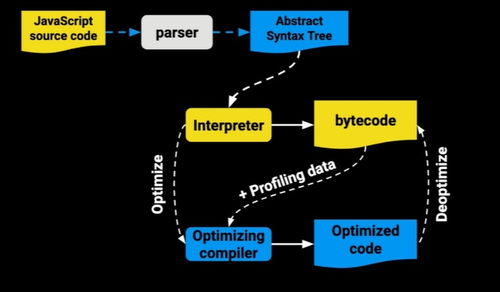 
</div>

**Javascript source code** pasa por el **parset** donde obtenesmos el AST, despues el **AST** se lo damos al **interpretador** que va a producir **bytecode** ahí es donde comienza a ejecutarse nuestro programa, bytecode es un lenguaje menor nivel pero va a permitir que se ejecute más rápido, **mientras se va ejecutando** hay un proceso que se llama el **profiling data** que va a estar analizando la ejecución va a encontrar los puntos donde el programa se puede optimizar y eventualemente va a producir el machine code, esto hace el *optimizing compiler** el **compilador de optimizaciones** y despues tenemos el **Optimized code**.

Hay veces en que estas asunciones fallan ahí deoptimize(deoptimizamos) el código.

### Analizador y Abstract Syntax Tree

**Parser:** un parser va a tomar tu código fuente y lo va a leer, pero lo que tu estas escribiendo no es la que la computadora entiende así tal cual como lo escribiste, primero lo tiene que descomponer y esa descomposicion o esos pedazos que van a salir se llamán **tokens**. Tokens identifican que let es una palabra clave o new es una palabra clave, que el simbolo de + es un operador y que lo que está aun lado y al otro o quizas son número u otro tipo de variable y una vez que tenemos esos tokens es cuando vamos a hacer el AST(Abstract Syntax Tree).

#### Fallo en el Parset

Que paso si el parser esta analizando tu programa y de momento hay algó que no hace sentido, justo es cuando ocurre un **sintax error**

Un **SyntaxError** es lanzado cuando el motor de javascript se encuentra con parte de código que no forman parte de la sintaxis del lenguaje al momento de analizar código.

El proceso de parsing es muy importante que se haga bien.

**Google dice:** 

- Parsing es 15% - 20% del proceso de ejecución.
- La mayoría del Javascript en una página nunca se ejecuta.
- Esto hace que **bundling y code splitting** sea muy importante!

La tercer parte significa que el código lo tenemos que empaquetar de una forma eficiente donde hay unos archivos de código separados lógicamente y que solamente vamos a cargar cuando sea necesario, esta es una modalidad que se esta volviendo muy frecuentemente de una solo página **Single Pages Apps**.

#### Parser de V8

##### Eager Parsing:

Cuando sea hace este parsing vamos a encontrar todos los errores de sintaxis en el código que se esta analizando y vamos a crear el AST. Que siemplemente es un árbol o arquitectura en forma de árbol que representa tu programa, y además va ha construir los scopes. En este momento vamos a saber que variables se pueden leer en que partes del código 

- Encuentrar errores de sintaxis
- Crea el AST
- Construye Scopes

##### Lazy Parsing

Cuando hacemos esto parsing estamos retrazando alguna parte del código porque no hace falta analizarla y puede esperar, esto tiene una ventaja y es que es el doble de rápido por lo tanto si las cosas tardaban 20% si logramos que ocurra mucho lazy parsing podemos retrazar ese analisis, una consecuencia es que el AST no se construye  y los Scopes se construyen parcialmente.

- Doble de rápido que el eager parser
- No crea el AST
- Construye los scopes parcialmente.

#### Tokens

Accediendo al siguiente enlce podemos ver con ejemplos la manera en como una sentencia de javascript se transpila a un token. [url](https://esprima.org/demo/parse.html#) o ingresando a [esprima](https://esprima.org/) 

Parser produces the (beautiful) syntax tree

```js
// Life, Universe, and Everything
var answer = "hola";
```

```json
[
    {
        "type": "Keyword",
        "value": "var"
    },
    {
        "type": "Identifier",
        "value": "answer"
    },
    {
        "type": "Punctuator",
        "value": "="
    },
    {
        "type": "String",
        "value": "\"hola\""
    },
    {
        "type": "Punctuator",
        "value": ";"
    }
]
```

#### Abstract Syntax Tree

El AST es un gráfo (estructura en forma de árbol). Donde vamos a tener una raíz que será nuestro programa y lo vamos a ir descomponiendo en partes, todo esto lo vamos a poder hacer siguiendo los tokens que produce el parser, esto se usa en muchisimos sitios, no solo para ejecutar un programa javascript, tembién lo usamos para transformar código de una forma a otra que es como lo que hace **babel** o **priged** 

Se usa en:
- Javascript Engine
- Bundlers: Webpack, Rollup, Parcel
- Transpilers: Babel
- Linters: ESLint, Prettify
- Type Checkers: TypeScript, Flow
- Syntax Highlighters

Demo de AST

```js
let foo = "bar";
```

<div align="cente">
  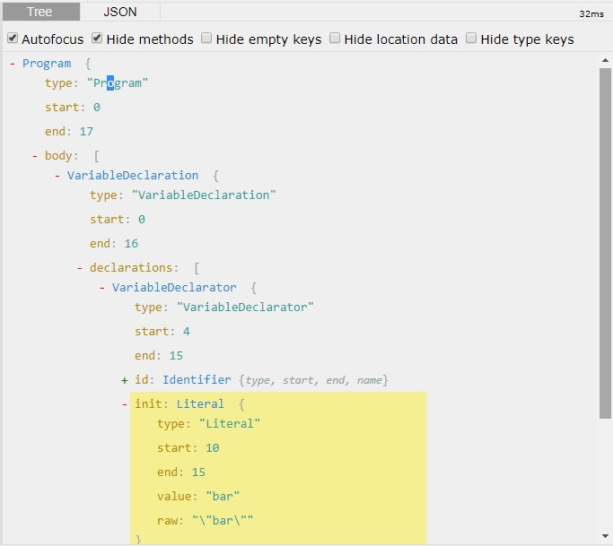
</div>

También puede construir tu propio ejemplo en [AST Explorer](https://astexplorer.net/)

## Abstract Syntax Tree en Práctica

Usemos el AST para crear una regla para Eslint, que analiza estáticamente nuestro código para ver si encuentra errores o si hay que leventar warnings porque estamos violando alguna regla de estilo o simplemente nuestro código esta vilolando la sintaxis del lenguaje, muchas de estas reglas ya vienen con Eslint pero también podemos desarrollar nuevas, para hacer eso vamos a desarrollar una herramienta que se llama [AST Explorer](https://astexplorer.net) En esté explorer tenemos que asegurarnos que la configuración es la correcta, si aquí no dice babel-eslint vamos a seleccionarla y vamos a ver como vamos a transformar el código. En esté caso lo vamos a procesar y vamos usar la última versión de eslint v4.

En la parte de abajo del lado izquierdo vamos a escribir esa regla y en la parte de abajo del lado derecho vamos a ver como esa regla esta funcionando.

La regla la vamos a definir dentro de una función y el nombre de esa función va a ser el nombre del nodo que queremos corregir. Si vamos al AST vemos que está parte del código trabaja con declaraciones de variables, cuando hay una declaración la queremos entender y si encontramos que el nombre esta en lowerCase que lo que hace es guardar un número, lo queremos corregir, así que vamos a corregir estó y copiaremos en esté caso el nombre del nodo "VariableDeclaration", está función es la que va a recibir un nodo.

Código al que queremos establecer reglas:
```js
const pi = 3.1415;
const halft_pi = 1.356;

// Variables constantes
// Variables que guarden un número 

// El nombre de la variable tiene que estar en UPPER CASE
```

Reglas que establecemos para el código usando EsLint
```js
export default function(context) {
  return {
  	VariableDeclaration(node) {
    	// Tipo de variable const
      if(node.kind === "const") {
      	const declaration = node.declarations[0];
        // asegurarnos que el valor es un número  
        if(typeof declaration.init.value === "number") {
        	if(declaration.id.name !== declaration.id.name.toUpperCase()) {
            	context.report({
                	node: declaration.id,
                  	message: "El nombre de la constante debe estar en Mayúsculas",
                  	fix: function(fixer) {
                    	return fixer.replaceText(declaration.id, declaration.id.name.toUpperCase());
                    }
                })
            }
        }
      }
    }
  };
};
```
## Como funciona el Javascript Engine

Despues de que el parser hizo su trabajo y nos dio el AST continua el interpretador, el compilador para obtener código optimizado. 

- Recibe código fuente
- Parsea el código y produce un Abstract Syntax Tree(AST)
- Se compila a bytecode
- Se optimiza a machine code y se remplaza el código base.

Cuando el bytecode se está ejecutando hay un observador, un programa que observa el bytecode y va a estar tomando notas, cuando tiene suficientes notas es capaz de tomar decisiones para optimizar tu código y así obtener código optimizado, si alguna de estas observaciones en el futuro resulta ser falsa y que todavía no se cumple, no pasa nada, tu código va a regresar a una versión ya optmizada donde va a seguir corriendo aunque no tan rápido.

### Bytecode vs Machine Code

El bytecode es algo parecido a assembly y assembly es un lenguaje de muy bajo nivel pero que aún se puede escribir, son palabras clave que le dicen al procesador que hacer. Es similar a Assembly excepto que en lugar de operar sobre un procesador va a operar sobre algo que se llama la virtual machine que es un programa que ejecuta bytecode.

El Machine Code es lo más bajo nivel, ni tu ni yo queremos escribir machine code a mano porque se trata básicamente de ceros y de unos, es código binario, pero los procesadores si lo necesitan así, es el código que les va a llegar a ellos y va a volar y es muy rápido porque el machine code no hay que traducirlo, ya esta traducido.

Cuando el motor de Javascript V8 que es el que ocupa chrome y node, produce esté código va a crearlo a machine code ya el bytecode que corre la máquina virtual no se va a ocupar.

El profiler es un programa que esta en medio del bytecode y el optimizador, este programa lo que hace es que toma una onbservación de la ejecución del bytecode y cuando ve que las funciones se estan llamando igual, una vez tras otra  y todas la llamadas son iguales, puede hacer unas optimizaciones, ejemplo:

```js
function add(a, b) {
  return a + b;
}

for (let i = 0; i < 1000; i++) {
  add(i, i);
}
```
Cuando el código se halla ejecutado ejemplo 50 veces, el código va a empezar a ponerse caliente, luego 100 iteraciones más y sera más caliente y así sucesivamente hasta que esta super caliente y esta listo para ser optimizado, en terminos del V8 le llamos hot function(función caliente). Esto significa que el optimizador de código ya esta listo para optimizar esa parte, esta seguro que la ejecución siempre es similar, recibe numeros, regresa numeros, entonces podemos optimizarla a machine code.

Que pasa si por la razón que sea, ya no estamos pasando 2 números como argumento, ahora estamos pasando 2 números y 1 cadena, el resultado sería el número 1 más el string todo pegado. Pero esto va a confundir el optimizador, y lo regresara a bytecode y lo que pasa es que se va a deoptimizar el código, tu puedes seguir programando, no pasara nada pero esto demuestra un poco de ineficiencia. Por esto es bueno que las funciones se llamen igual, si le pasamos objetos que tengan una forma diferente o argumentos de tipos diferentes o no se va a poder optimizar tu función o se va ha deoptimizar, pero esto es así.

Los motores de Javascript funcionan ligeramente diferente, cada browser tiene su propia implementación aunque todos siguen una estructura parecida, el que acabamos de analizar fue V8.

#### SpiderMonkey vs V8

SpiderMonkey tiene 2 capas de optimización, Chakra también y recibe información de profiler y de varios lugares. **JavascriptCore tiene 3 capas de optimización**. 
¿Esto significa que safari es más rápido que chrome? No necesariamente, en el desarrollo de programas o de ingeniería siempre se trata traetors, intercambio de costos beneficios, esto quizas no sea perfecto, pero luego saldra mejor, y en javascriptCore puede ser que nuestro programa tarde un poquito más en comenzar, pero una vez que se inicialice el profiler comienza a actuar, optimiza poco y luego otro poco, asi sucesivamente.

Mientras que en chrome nuestro programa empieza a ejecutarse rápido y quizas toma un poco más de tiempo en que se optmize pero así es como funcionan los motores de javascript.

### Event Loop

Si lo tuvieramos que describir en una oración: El eventLoop es lo que hace que javascript parezca ser multihilo cuando realmente es un solo hilo, entonces como rayos es que podemos hacer scroll, click, cargar un imagen, hacer una petición, miles de cosas haciendo eso una sola vez.

Tenemos que saber que Javascript se organiza usando 2 estructuras de datos, es el Stack y el Heap.

<div align="center">
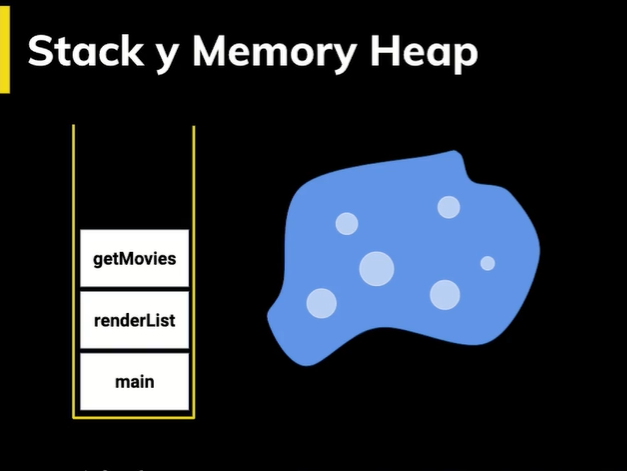
</div>

El stack es una estructura de datos que lleva rastro de donde está el programa, si un programa comienza con una función main, a su vez llama a renderList y renderList llamá a getMovies, es Stack se vería algo así.

También tenemos el memory heap, el memory heap es una estructura desorganizada, en el stack hay un orden, una función dentro de una función, una dentro de otra, el memory Heap es completamente aleatoria y ahí es donde se guarda la información de las variables, el scope, etc.

El stack comenzará vacío, pero vamos a hacer una operación que se llama un push y vamos a poner como si ponemos un plato, entonces en ese contenedor que solo esta abierto para arriba, hay un plato, si vovemos a hacer un push pusimos otro plato encima, hacemos push, otro plato encima, ahora que pasa si tu quisieras quitar el plato que estaba hasta abajo, no puedes porque no hay forma de sacarlo por enfrente, ni por debajo, solamente por arriba, por lo tanto tienes que sacar el plato que esta hasta arriba, para sacar otro plato y por fin sacar otro plato.

Esa operación de sacar se llama pop, si hacemos pop sale getMovies, si volvemos a hacer pop sale renderList, y si volvemos a hacer pop sale mainy el obtenemos el stack vacío.

<div align="center">
  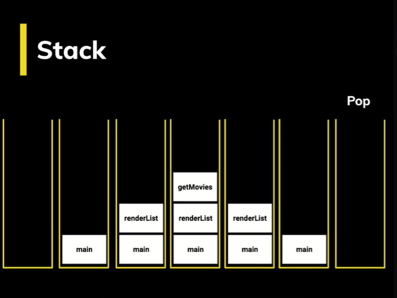
</div>

El stack es donde están nuestras funciones, es el registro de como esta operando nuestro programa, apunta a variables como el scope.

<div align="center">
  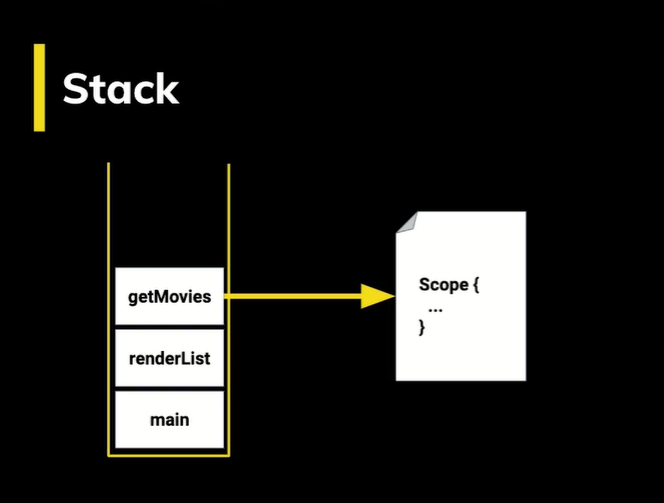
</div>

Es donde dice estas cosas en está función tienen acceso al entorno global, esto tiene acceso al scope de la función, esto tiene acceso al scope de un bloque y nos guarda esa información.

Entonces si tenemos un programa como este:

<div align="center">
  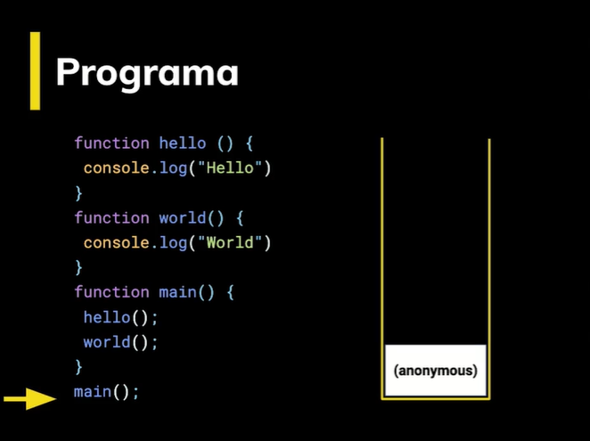
  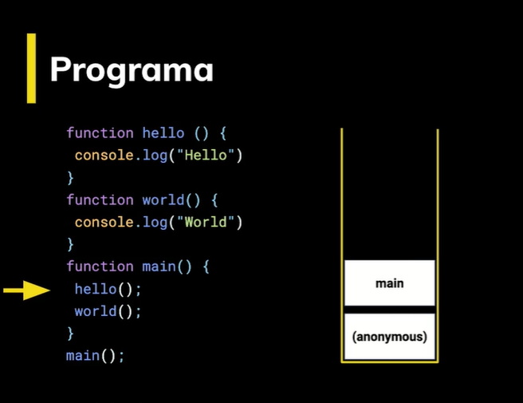
  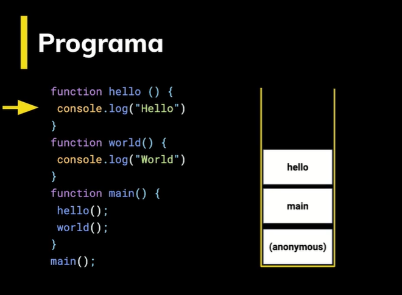
  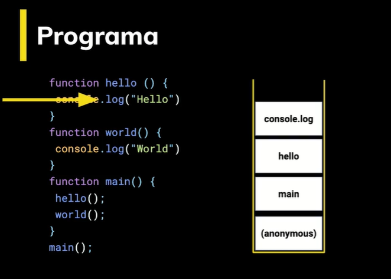
</div>

Y así sucesivamente van agregando y quitando ejecuciones en el orden correspondiete.

Cuando se ejecuta una función asincrona, como por ejemplo un setTimeout, lo reconoce pero no lo ejecuta, sigue con su proceso normal y luego aparece otra vez para ejecutar la función que ejecutaría un setTimeout.

Parece raro pero esta es la asincronia, cosas que van a pasar eventualmente, pues eventualmente pasarán, pero aún no les toca.

<div align="center">
  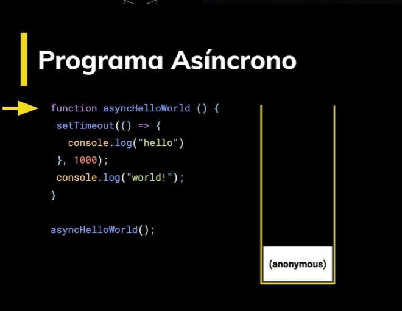
  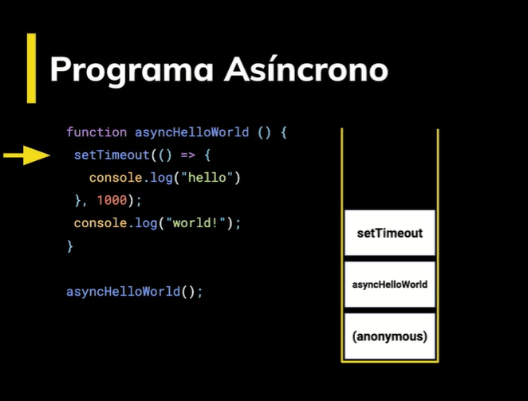
  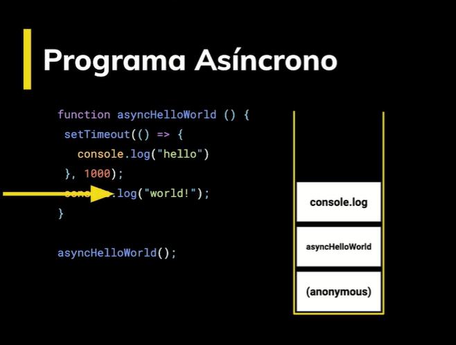
  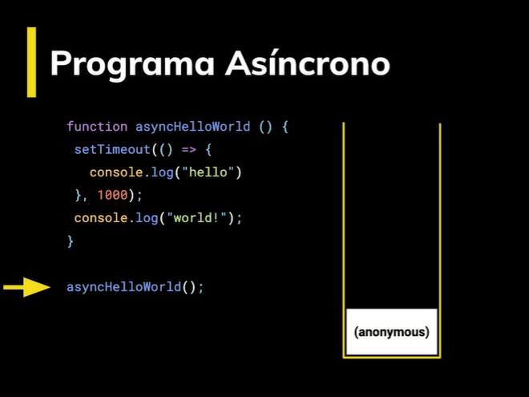
  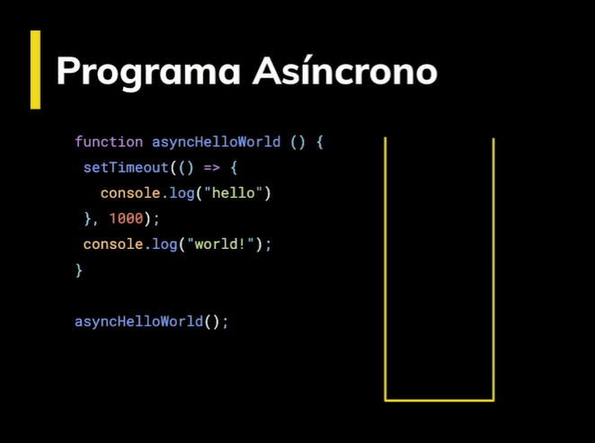
  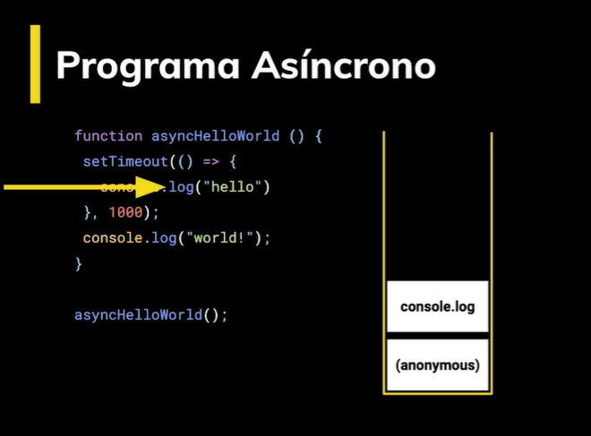
  
</div>

## Task Queue

¿Como funciona estó?

Para poder entenderlo tenemos que hablar sobre **Queue**: es una estructura de datos igual que el stack donde si el stack las cosas, lo primero que entra es lo último que sale. En el **Queue lo primero que entra es lo primero que sale**, es como ir al banco y hacemos una fila, el que llegó primero es al que van a antender primero 

Teniendo en cuenta esto vamos a hablar sobre la cola de tareas.

Cuando teniamos el setTimeout encolamos una tarea que ibamos a hacer en 1000 milisegundos.

<div align="center">
  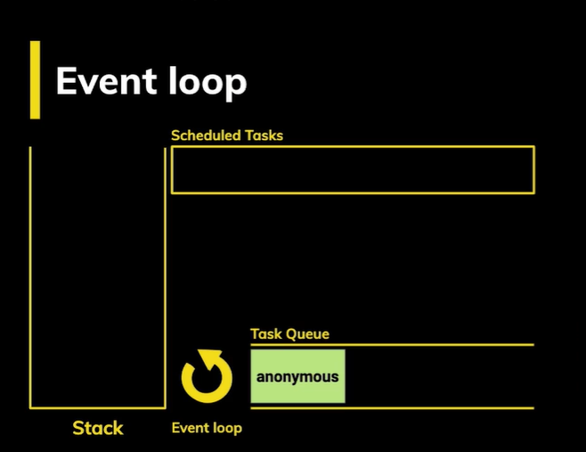
  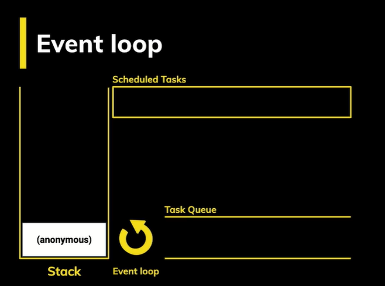
</div>

¿Qué pasa si el stack no está vacío?

<div align="center">
  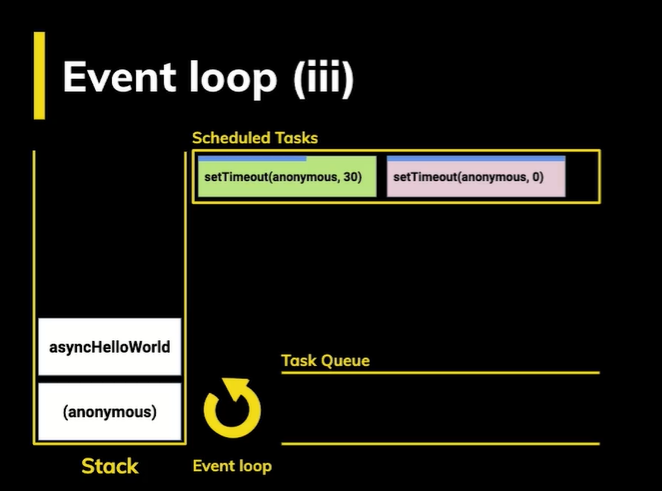
  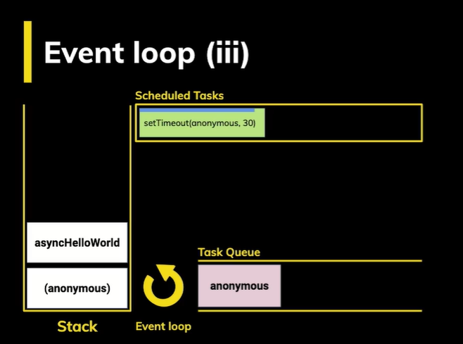
  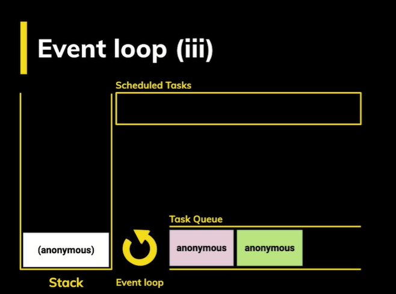
  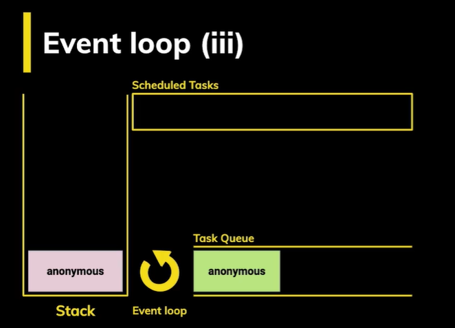
  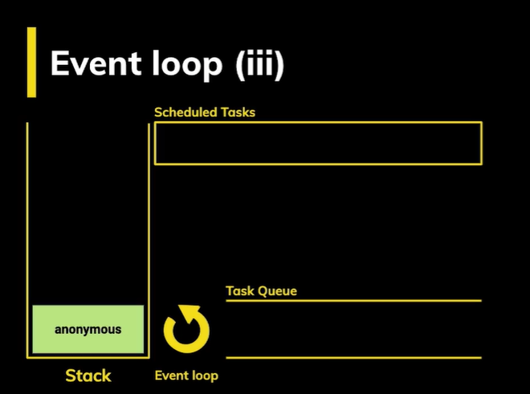
</div>

## Event Loop con Promesas

Las promesas son algo que eventualmente va a pasar, se puede resolver una promesa o se puede rechazar pero lo importante es que eventualmente, esto es asincrono, entonces llevamos este programa de nombre moreAsync.

<div align="center">
  
</div>

Resulta que las promesas van en otra cola, la cola de microtareas **Microtask Queue**. Las microtareas son de mayor preoridad y seimpre van primero sobre el scheduled task.

<div align="center">
  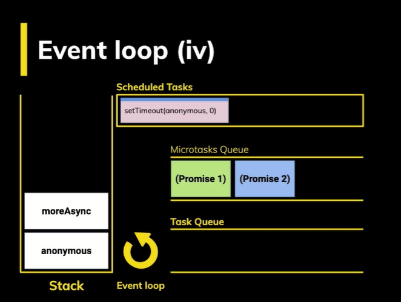
  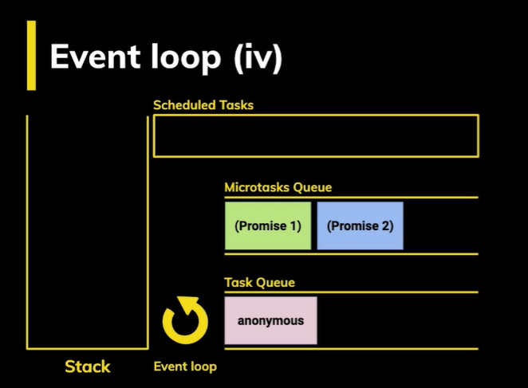
  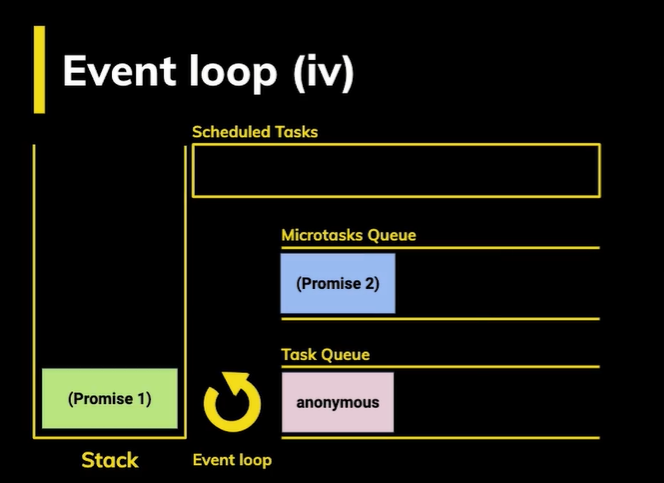
  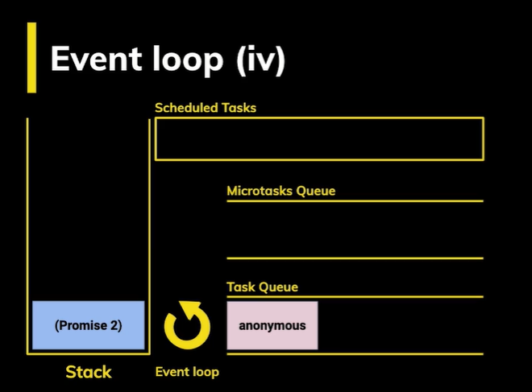
  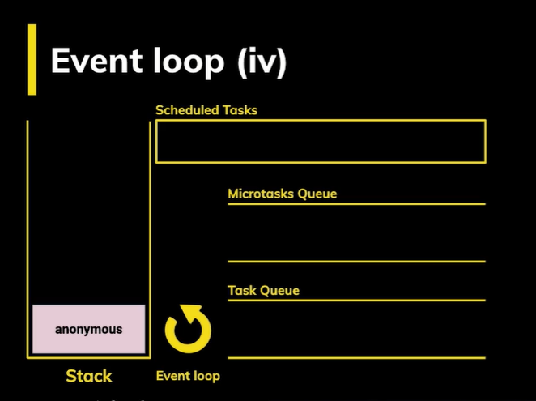
</div>
